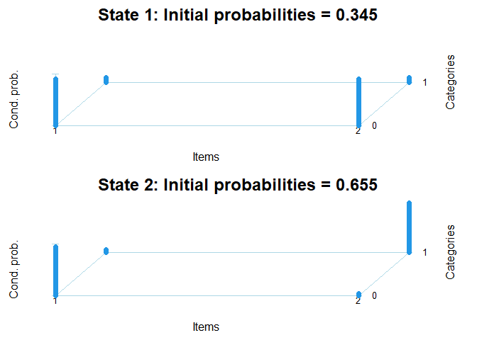
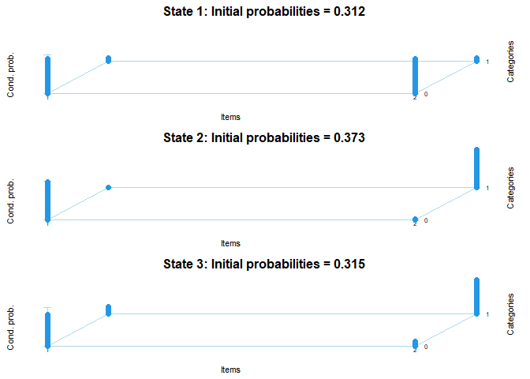
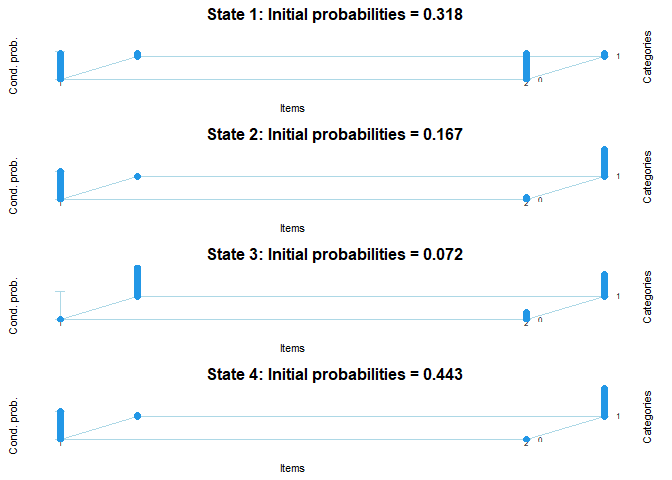
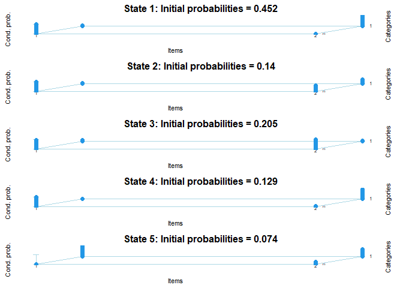
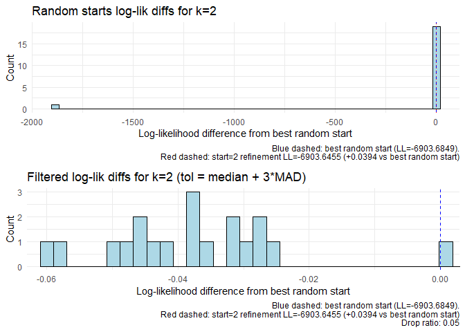
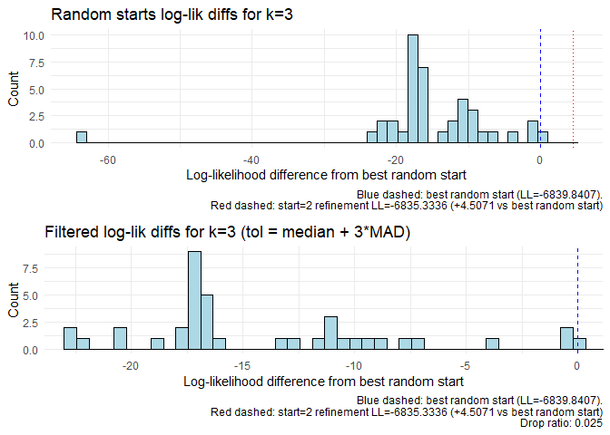
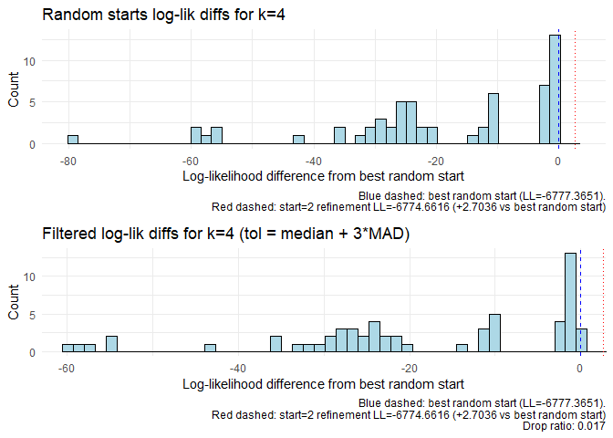
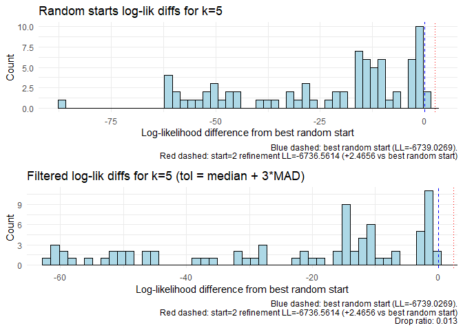
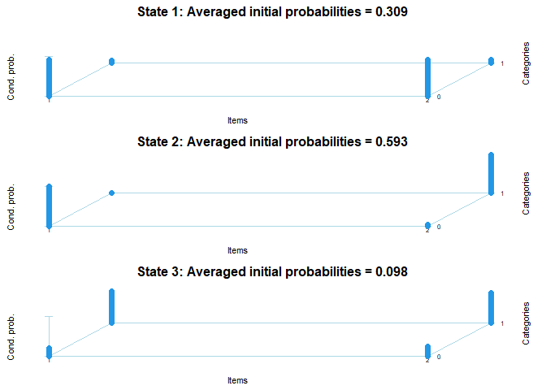

Custom Lmest Functions
================
Diego Vitali
09 April, 2026

- [Introduction](#introduction)
- [Plotting function for
  lmestSearch()](#plotting-function-for-lmestsearch)
  - [What lmestsearch does](#what-lmestsearch-does)
  - [What lmestSearch_plot() adds to
    lmestsearch()](#what-lmestsearch_plot-adds-to-lmestsearch)
- [LMest() output handlers, basic gatekeeping and
  diagnostics](#lmest-output-handlers-basic-gatekeeping-and-diagnostics)
  - [get_observed_InitialStates_counts()](#get_observed_initialstates_counts)
    - [example usage](#example-usage)
  - [get_observed_transition_counts()](#get_observed_transition_counts)
    - [example usage](#example-usage-1)
  - [initial_prob_Diagnostics()](#initial_prob_diagnostics)
    - [example usage](#example-usage-2)
  - [transition_Diagnostics_multilogit()](#transition_diagnostics_multilogit)
    - [Example usage](#example-usage-3)
    - [Explaining how summary_table() parses LMest ouput
      arrays.](#explaining-how-summary_table-parses-lmest-ouput-arrays)
- [Parallel multi-start fitting:
  `lmest_parallel()`](#parallel-multi-start-fitting-lmest_parallel)
  - [Theoretical Motivation](#theoretical-motivation)
  - [Parameters](#parameters)
    - [Batching](#batching)
    - [Return value](#return-value)
  - [Sketch](#sketch)
  - [Notes for package integration](#notes-for-package-integration)
  - [Example usage](#example-usage-4)

# Introduction

This document proposes a set of additions to the LMest package to
support convergence diagnostics, model output interpretation, and
parallel estimation. All functions are illustrated using the built-in
`PSIDlong` dataset. Each proposed function is self-contained: it takes a
fitted `lmest` model object as its primary input and returns results
consistent with existing LMest conventions.

**Proposed additions:**

- `lmestSearch_plot()` — complements `lmestSearch()` by plotting the
  distribution of log-likelihood differences across random starts,
  providing a visual and quantitative assessment of LL surface, and
  insight into the assess `nrep`.

- `get_observed_InitialStates_counts()` — returns the observed count of
  subjects assigned to each latent state at baseline via global
  (Viterbi) decoding, providing a proxy class-size check for separation
  and EPV diagnostics.

- `get_observed_transition_counts()` — returns the observed count of
  state-to-state transitions via global or local decoding, providing the
  denominator for EPV-based adequacy checks on transition probability
  estimates.

- `initial_prob_Diagnostics()` — summarises covariate coefficients for
  the initial state probabilities with standard errors, confidence
  intervals, significance flags, EPV, and separation warnings.

- `transition_Diagnostics_multilogit()` — summarises covariate
  coefficients for the transition probabilities from a specified
  starting state, with the same gatekeeping flags as
  `initial_prob_Diagnostics()`.

- `lmest_parallel()` — wraps `lmest()` in a `future_lapply()` call to
  distribute independent random-start replications across parallel
  workers, selecting the best model by log-likelihood, and reporting a
  stability summary across workers.

------------------------------------------------------------------------

``` r
data("PSIDlong")
```

- Defining latent states indicators using “Fertility” and “employment”.
- Defining predictors of initial states prob. a transition prob: In this
  case the predictors are the same for both.

``` r
latent_state_vars<-c("Y1Fertility", #Y1
                     "Y2Employment" #Y2
                     )


initial_prob_vars<- c( "X1Race",       
                       "X2Age",        
                       "X4Education",
                       "X9Income"
                     )

trans_prob_vars <-   initial_prob_vars
```

# Plotting function for lmestSearch()

In this work I followed (as much as possible) Moore et al
\[(2025)\]\[<https://onlinelibrary.wiley.com/doi/full/10.1002/ijop.70021>\]
and other papers mentioned in the pipeline. The basis lmestSearch()
running all the possible K+ 1 models. Given the customary lmest example
(PSIDlong), indicators are 2 binary variables, therefore we can set
lmestsearch with k+1 = 5.

## What lmestsearch does

The existing function lmestSearch() addresses model selection based on
AIC and BIC and provides information to explore the multimodality of the
likelihood function. Lmest provides two main criteria to select the
number of latent states: AIC and BIC. For example, for the PSIDlong
dataset we can estimate the basic LM model for increasing values of the
latent states $k$. Therefore, the lmestSearch systematically fit models
with various values of $k$ and compares their fit based on information
criteria (AIC and BIC) as also suggested in Moore et al. (2025). The
lmestSearhc function progresses as follow:

1.  lmestSearch() runs the estimation for several values of $k$ (number
    of latent classes/states), each time recording log-likelihood
    ($lk_k$), AIC, and BIC.
2.  For each value of $k$, lmestSearch() performs multiple random
    initializations to mitigate the risk of local maxima due to
    likelihood multimodality. This is explicitely warranted in Moore et
    al. (2025).
3.  lmestSearch() outputs and compares AIC and BIC values across
    candidate models, so that we can select the solution that best
    balances fit and parsimony. BIC is generally preferred in
    longitudinal latent class modeling for its stronger penalty on model
    complexity, as per the recommendations in the literature.

Therefore here we take the example where we aim to:

1.  explore what is a reasonbly large number of tries (random starts)
2.  look at both lk and AIC/BIC to determine the optimal $k$

``` r
fmLatent<-lmestFormula(data = PSIDlong, response = latent_state_vars, 
                                LatentInitial = initial_prob_vars,
                                LatentTransition =trans_prob_vars)

Lmest_search_out <- lmestSearch(responsesFormula =  fmLatent$responsesFormula,
                   index = c("id","time"),
                   data = PSIDlong,
                   version ="categorical",  # type of response
                   k = 1:5,
                   modBasic = 1, 
                   nrep = 20,
                   maxit = 10000,
                  # fort = T,
                   seed = 12345)

summary(Lmest_search_out)

plot(Lmest_search_out$out.single[[2]], what ="CondProb")
```

<!-- -->

``` r
plot(Lmest_search_out$out.single[[3]], what ="CondProb")
```

<!-- -->

``` r
plot(Lmest_search_out$out.single[[4]], what ="CondProb")
```

<!-- -->

``` r
plot(Lmest_search_out$out.single[[5]], what ="CondProb")
```

<!-- -->

``` r
Lmest_search_out$out.single[[2]]$Psi
Lmest_search_out$out.single[[3]]$Psi
Lmest_search_out$out.single[[4]]$Psi
```

In lmest() the number of traces (fit attempts) per k is proportional to
(k-1) and *nrep* so that number of random starts will be \$ (k-1) \*
nrep\$. In particular lmestSearch() proceed with 1 deterministic
baseline initialisation followed by \$ (k-1) \* nrep\$ random start, and
then completes the exploration with a determininist refined solution
that uses initial values taken from the best solution:

| Start Value | Purpose | Typical Count per $k$ |
|----|----|----|
| 0 | Deterministic baseline initialization | 1 run |
| 1 | Random starts with random initial values | $nrep \times (k-1)$ |
| 2 | Initial values are taken from best solution | 1 run |

for example, for $k=3$, with $nrep = 20$ our lmestSearch output will
have an lktrace array which carries the following 42 unit long lltrace
sequence (Lmest_search_out$out.single[[3]]$lktrace):

- first ll: determininistic ll (start = 0).
- 40 random starts: 20 \* (3-1) = 40 random start (start = 1),
- last ll: determininistic approach that (i think!) uses the paramenters
  of the best model as starting values(start = 2).

the ll value with start =0 and that with start = 2 are respectively the
first and the last value in each lktrace.

NOTE: **I took this from the lmest source code and by observing the
output**

**If LMest ever changes the ordering of lktrace or adds entries, the
slice \[2:(n-1)\] silently produces wrong results. this is a soft
dependency on the internal structure. However, if LMest() in the future
could expose lktrace with named elements this plotting function will
become more robust – e.g. list(deterministic = .. ; random = …; refined
= …).**

``` r
# lktrace: all convergence ll are recorded under %lktrace
Lmest_search_out$out.single[[3]]$lktrace
```

    ##  [1] -6836.984 -6857.022 -6852.912 -6848.881 -6851.544 -6840.569 -6851.015
    ##  [8] -6857.195 -6843.545 -6849.039 -6862.089 -6856.849 -6856.921 -6856.303
    ## [15] -6857.185 -6846.767 -6856.348 -6855.857 -6856.356 -6858.606 -6856.348
    ## [22] -6857.103 -6857.483 -6840.578 -6850.190 -6857.244 -6839.841 -6903.544
    ## [29] -6862.569 -6860.223 -6857.139 -6852.682 -6850.781 -6857.123 -6862.310
    ## [36] -6857.404 -6847.554 -6860.595 -6856.700 -6849.649 -6850.703 -6835.334

``` r
# how many runs, in this case (start = 1) and k = [3] we have 40 random starts (20 * (3-1)) + 2 deterministic runs
#length(Lmest_search_out$out.single[[3]]$lktrace) # gives 40+2 = 42
```

**BUT how many random starts is enough ?**

In the case of PSIDlong the reponse model is not very complex, but if we
have a complex response model it maybe difficult to confidently chose a
adequate number of random starts. The aim of this plot function is to be
a compliment of lmestsearch, and to help the user evaluate the number of
random starts used:

- is *nrep* large enough to adequately explore the parameter space?
- is *nrep* large enough to reach a convergence ll parameter that is
  unlikely smaller than the global maximum - up to a negligeable
  tolerance level.

In order to help supporting this exploration process I set up
*lmestSearch_plot()*

## What lmestSearch_plot() adds to lmestsearch()

The aim of this function is to assess the stability and convergence of
latent markov model fits by analysing the distribution of log-likelihood
values obtained from multiple random starts.

The function takes as input a collection of log-likelihood traces
obtained from different initialization runs for a given number of latent
states (k). It focuses on the randomly initialized runs, excluding the
initial deterministic run and the final refinement run. The aim here is
to analyze the dispersion of the log-likelihood values found via the
random starts.

By calculating the difference between each run’s log-likelihood and the
highest log-likelihood observed across all runs, we capture how close
each solution is to the best estimate. We then compute summary
statistics like the median and the median absolute deviation (MAD) of
these differences to understand the spread in the estimates.

To identify potentially unstable or suboptimal runs, the function uses a
cutoff defined as the sum of the median difference plus a user-defined
multiple of the MAD (defaulting to 3). Miller (1991) recommends using 2,
2.5, or 3 as the value k, depending on the purpose of outlier detection,
while Leys et al. (2013) recommend a criterion of 2.5”. Runs with
log-likelihood differences exceeding this cutoff are flagged as possible
outliers, indicating that these runs are likely converging to inferior
local maxima. This is particularly helpful to visualise the distribution
of the ll_diff scores that are closer to the best LL value.

``` r
lmestSearch_plot <- function(all_lks, k = 4, k_multiplier = 3, plot_hist = TRUE) {
  best_lk <- all_lks[[k]]$lk
  lktrace_all <- all_lks[[k]]$lktrace
  
  # Assume that lktrace contains:
  #  . one start=0 fit as first lk,
  #  . nrep*k-1 start = 1 lk
  #  . one start=2 fit as last run
  # I exclude both start0 and start2 to focus on the random start distribution
  if(length(lktrace_all) > 2){
    random_lktrace <- lktrace_all[2:(length(lktrace_all) - 1)]
  } else {
    random_lktrace <- lktrace_all
  }
  
  # Store absolute best (probably from start=2, last run)
  # perhaps here we could compare with last run to flag whenever the absolute 
  # best lk is not coming from start=2
  abs_best_lk <- lktrace_all[length(lktrace_all)]
  
  max_lk <- max(random_lktrace)
  diff_array <- random_lktrace - max_lk
  abs_diff <- abs(diff_array)
  
  median_diff <- median(abs_diff)
  mad_diff <- mad(abs_diff)
  # Cutoff calculation
  # Define cutoff as median + 3 * MAD [https://pmc.ncbi.nlm.nih.gov/articles/PMC8801745/] 
  # "For example, Miller (1991) recommends using 2, 2.5, or 3 as the value k, depending on 
  # the purpose of outlier detection, while Leys et al. (2013) recommend a criterion of 2.5 as the value k"
  cutoff <- median_diff + k_multiplier * mad_diff
  
  filtered_diffs <- diff_array[abs_diff <= cutoff]
  dropped_diffs <- diff_array[abs_diff > cutoff]
  drop_ratio <- length(dropped_diffs) / length(abs_diff)
  
  df_all <- data.frame(diffs = diff_array, type = "Random starts")
  df_filtered <- data.frame(diffs = filtered_diffs, type = "Filtered")
  
  if(plot_hist){
    # start=2 uses the best run's *converged* parameters as initial values (not the
    # original random seed), so refinement_diff > 0 means the EM travelled further
    # from an already-converged solution — a large gap flags incomplete convergence.
    refinement_diff <- abs_best_lk - max_lk
    refine_label <- sprintf("Red dashed: start=2 refinement LL=%.4f (%+.4f vs best random start)",
                            abs_best_lk, refinement_diff)

    p1 <- ggplot(df_all, aes(x = diffs)) +
      geom_histogram(fill = "lightblue", color = "black", bins = 50) +
      geom_vline(xintercept = 0,               color = "blue", linetype = "dashed") +
      geom_vline(xintercept = refinement_diff, color = "red",  linetype = "dotted") +
      labs(title = paste0("Random starts log-lik diffs for k=", k),
           x = "Log-likelihood difference from best random start",
           y = "Count",
           caption = paste0("Blue dashed: best random start (LL=", round(max_lk, 4), ").\n", refine_label)) +
      theme_minimal()

    p2 <- ggplot(df_filtered, aes(x = diffs)) +
      geom_histogram(fill = "lightblue", color = "black", bins = 50) +
      geom_vline(xintercept = 0,               color = "blue", linetype = "dashed") +
      geom_vline(xintercept = refinement_diff, color = "red",  linetype = "dotted") +
      coord_cartesian(xlim = range(filtered_diffs)) +
      labs(title = paste0("Filtered log-lik diffs for k=", k,
                          " (tol = median + ", k_multiplier, "*MAD)"),
           x = "Log-likelihood difference from best random start",
           y = "Count",
           caption = paste0("Blue dashed: best random start (LL=", round(max_lk, 4), ").\n",
                            refine_label, "\nDrop ratio: ", round(drop_ratio, 3))) +
      theme_minimal()

    grid.arrange(p1, p2, ncol = 1)
  }
  
  return(list(
    median_diff = median_diff,
    mad_diff = mad_diff,
    cutoff = cutoff,
    drop_ratio = drop_ratio,
    filtered_diffs = filtered_diffs,
    dropped_diffs = dropped_diffs,
    abs_best_lk = abs_best_lk
  ))
}
```

In this example we examine the random starts for k = 2,3,4,5

<!-- --><!-- --><!-- --><!-- -->

    ## Median absolute diff near max for state 2: 0.03848589

    ## Median absolute diff near max for state 3: 16.51135

    ## Median absolute diff near max for state 4: 20.78472

    ## Median absolute diff near max for state 5: 15.09641

The plots complement the output of lmestSearch() and allow to:

- evaluate the stability of the estimate
- expose multimodality of the log-likelihood surface

Overall they provide valuable insight on both *the stability of the
convergence* at each k state, and *the complexity of the parameter
space*.

Blue and red dotted lines. The refinement run (start=2) re-runs the EM
from the best random start’s parameter that was found at convergence.
This means that the refinement run can only improve using as starting
point the best model found via random starts. A large difference between
red (refinement fit ) and blue dashed lines (random start best fit)
shows that the best random fit was likely a local maxima. Although
finding no difference between refinement fit and best random start fit
does not represent a single validation criterion for `K`, `nrep`, or
`maxit`, finding a large improvement with the refinement run should flag
careful attention.

# LMest() output handlers, basic gatekeeping and diagnostics

I propose here some tools that can facilitate some aspects of working
with lmest():

- `get_observed_InitialStates_counts()`: decodes the model’s state
  assignments and returns observed counts of subjects in each state at
  the first time point
- `get_observed_transition_counts()`: decodes state sequences and counts
  observed transitions between states across all time pairs, either
  globally or by transition pair.
- `initial_prob_Diagnostics()`: extracts and formats the multinomial
  logit coefficients (with SEs, CIs, EPV) for the initial state
  probability model (Piv regressors), with optional significance
  flagging.  
- `transition_Diagnostics_multilogit()`: extracts and formats the
  multinomial logit coefficients (with SEs, CIs, EPV) for the transition
  probability model from a specified start state (Pi regressors),
  covering all destination states.

``` r
mod2 <- lmest(responsesFormula = fmLatent$responsesFormula,
             latentFormula =  fmLatent$latentFormula,
             index = c("id","time"),
             data = PSIDlong, 
             k = 3, # diagnostics suggest 2 but I need 3 for a later example on parameter estimates
             paramLatent = "multilogit",
             start = 0, 
             seed = 1234,
             out_se=TRUE) 
```

    ## ------------|-------------|-------------|-------------|-------------|-------------|
    ##       k     |    start    |     step    |     lk      |    lk-lko   | discrepancy |
    ## ------------|-------------|-------------|-------------|-------------|-------------|
    ##           3 |           0 |           0 |    -9173.83 | 
    ##           3 |           0 |          10 |    -6636.29 |     3.84517 |    0.138565 | 
    ##           3 |           0 |          20 |    -6625.38 |    0.338339 |   0.0181772 | 
    ##           3 |           0 |          30 |     -6623.3 |     0.16425 |   0.0184209 | 
    ##           3 |           0 |          40 |     -6621.7 |    0.165041 |   0.0164063 | 
    ##           3 |           0 |          50 |    -6619.93 |    0.185941 |    0.011398 | 
    ##           3 |           0 |          60 |    -6618.01 |    0.192991 |   0.0132706 | 
    ##           3 |           0 |          70 |    -6616.16 |    0.177801 |   0.0125392 | 
    ##           3 |           0 |          80 |    -6614.33 |    0.206994 |   0.0225812 | 
    ##           3 |           0 |          90 |    -6611.09 |    0.339865 |   0.0695532 | 
    ##           3 |           0 |         100 |    -6608.72 |    0.202135 |   0.0467705 | 
    ##           3 |           0 |         110 |    -6606.67 |    0.173041 |   0.0208624 | 
    ##           3 |           0 |         120 |     -6604.8 |    0.199594 |   0.0196968 | 
    ##           3 |           0 |         130 |    -6602.04 |    0.239863 |   0.0458837 | 
    ##           3 |           0 |         140 |    -6600.46 |    0.115161 |  0.00966735 | 
    ##           3 |           0 |         150 |     -6599.5 |   0.0818204 |  0.00455291 | 
    ##           3 |           0 |         160 |    -6598.78 |   0.0652758 |  0.00547807 | 
    ##           3 |           0 |         170 |    -6598.18 |   0.0579623 |  0.00641127 | 
    ##           3 |           0 |         180 |    -6597.61 |   0.0569855 |  0.00663575 | 
    ##           3 |           0 |         190 |    -6597.02 |   0.0614295 |  0.00720423 | 
    ##           3 |           0 |         200 |    -6596.35 |   0.0718981 |  0.00719661 | 
    ##           3 |           0 |         210 |    -6595.54 |   0.0905412 |  0.00672576 | 
    ##           3 |           0 |         220 |    -6594.47 |    0.121284 |  0.00961431 | 
    ##           3 |           0 |         230 |    -6593.02 |    0.168704 |   0.0142465 | 
    ##           3 |           0 |         240 |    -6590.99 |     0.23021 |   0.0179795 | 
    ##           3 |           0 |         250 |     -6588.5 |     0.24898 |     0.01514 | 
    ##           3 |           0 |         260 |    -6586.49 |    0.155526 |   0.0214377 | 
    ##           3 |           0 |         270 |    -6585.29 |    0.101188 |   0.0105088 | 
    ##           3 |           0 |         280 |    -6584.36 |   0.0900388 |   0.0126634 | 
    ##           3 |           0 |         290 |    -6583.42 |   0.0974253 |   0.0325171 | 
    ##           3 |           0 |         300 |     -6582.6 |   0.0711063 |   0.0179364 | 
    ##           3 |           0 |         310 |    -6581.91 |   0.0672861 |   0.0118668 | 
    ##           3 |           0 |         320 |     -6581.3 |   0.0517856 |  0.00437445 | 
    ##           3 |           0 |         330 |    -6580.89 |   0.0347276 |  0.00256604 | 
    ##           3 |           0 |         340 |     -6580.6 |    0.024716 |  0.00208507 | 
    ##           3 |           0 |         350 |    -6580.39 |   0.0175149 |  0.00169927 | 
    ##           3 |           0 |         360 |    -6580.25 |   0.0123924 |  0.00154968 | 
    ##           3 |           0 |         370 |    -6580.15 |  0.00879869 |  0.00146835 | 
    ##           3 |           0 |         380 |    -6580.07 |  0.00629099 |   0.0013935 | 
    ##           3 |           0 |         390 |    -6580.02 |  0.00454041 |  0.00133151 | 
    ##           3 |           0 |         400 |    -6579.98 |  0.00331376 |  0.00128805 | 
    ##           3 |           0 |         410 |    -6579.95 |  0.00244972 |  0.00126919 | 
    ##           3 |           0 |         420 |    -6579.93 |  0.00183814 |  0.00128287 | 
    ##           3 |           0 |         430 |    -6579.92 |  0.00140437 |  0.00134102 | 
    ##           3 |           0 |         440 |     -6579.9 |   0.0010984 |  0.00146265 | 
    ##           3 |           0 |         450 |    -6579.89 | 0.000887898 |  0.00167751 | 
    ##           3 |           0 |         460 |    -6579.89 | 0.000754435 |  0.00235035 | 
    ##           3 |           0 |         470 |    -6579.88 | 0.000692061 |  0.00370204 | 
    ##           3 |           0 |         480 |    -6579.87 | 0.000705672 |  0.00616993 | 
    ##           3 |           0 |         490 |    -6579.86 | 0.000797177 |   0.0101893 | 
    ##           3 |           0 |         500 |    -6579.86 | 0.000912896 |   0.0142766 | 
    ##           3 |           0 |         510 |    -6579.85 | 0.000977631 |   0.0238635 | 
    ##           3 |           0 |         520 |    -6579.84 |  0.00117838 |   0.0387671 | 
    ##           3 |           0 |         530 |    -6579.82 |  0.00171539 |   0.0394032 | 
    ##           3 |           0 |         540 |    -6579.81 |  0.00111505 |  0.00668411 | 
    ##           3 |           0 |         550 |     -6579.8 | 0.000784903 |  0.00200167 | 
    ##           3 |           0 |         560 |    -6579.79 |   0.0006107 |   0.0009602 | 
    ##           3 |           0 |         570 |    -6579.79 | 0.000479893 | 0.000654794 | 
    ##           3 |           0 |         580 |    -6579.78 | 0.000378195 | 0.000522757 | 
    ##           3 |           0 |         590 |    -6579.78 | 0.000298826 | 0.000439977 | 
    ##           3 |           0 |         600 |    -6579.78 | 0.000236715 | 0.000375191 | 
    ##           3 |           0 |         610 |    -6579.77 | 0.000187971 | 0.000322673 | 
    ##           3 |           0 |         620 |    -6579.77 | 0.000149604 | 0.000279326 | 
    ##           3 |           0 |         630 |    -6579.77 | 0.000119325 |   0.0002431 | 
    ##           3 |           0 |         640 |    -6579.77 | 9.53615e-05 | 0.000212524 | 
    ##           3 |           0 |         650 |    -6579.77 | 7.63484e-05 | 0.000186501 | 
    ##           3 |           0 |         657 |    -6579.77 | 6.54079e-05 | 0.000170542 | 
    ## ------------|-------------|-------------|-------------|-------------|-------------|

``` r
plot(mod2, what="CondProb")
```

<!-- -->

## get_observed_InitialStates_counts()

*it is important that the model solution is interpretable, which
includes having multiple characteristics. First, from an absolute sense,
the sample size for the smallest class needs to be large enough for the
researcher to be comfortable interpreting it out to the population.
Class size can become a challenge, particularly if there are
realistically low frequency classes enumerated. For example, if
examining classes related to types of drug use, the proportion of
responders who regularly use heroin is likely small in both the
population and the representative sample. *
\[<https://onlinelibrary.wiley.com/doi/full/10.1002/ijop.70021>\]

The *get_observed_InitialStates_counts()* uses global decoding to get
the “cell sizes” for each initial latent state. I use global decoding as
default here to get the “$Ug$ object. The first column of this object
will be”time 1” state allocation for all subjects in the data set.

These counts are essential because (provided a decent model fit) these
decoded class membership counts should be (very) close to the expected
membership targetted by the multinomial logistic regression. Of course
the decoded states does not capture the uncertainty that exists in the
model around state membership but here I assume they provide a proxy
base for diagnostics. *Please advise if this assumption is wrong.*

### example usage

``` r
N_obs_states<-get_observed_InitialStates_counts(mod2)

N_obs_states %>% kable(col.names = c("","count"), 
                       caption = "Count of respondents by each allocated latent state at baseline")
```

|         | count |
|:--------|------:|
| State 1 |   477 |
| State 2 |   860 |
| State 3 |   109 |

Count of respondents by each allocated latent state at baseline

## get_observed_transition_counts()

This is very similar to get_observed_initialStates_counts() but with the
transition counts I put the option to chose whether using global
decoding or local deconding. Exacly as we did for the initial state
counts, the transition counts estimated via global decoding are
essential in this function because they provide a proxy base for many
diagnostics.

``` r
get_observed_transition_counts <- function(model, option = "global") {
  # Get decoded sequences
  dec <- lmestDecoding(model)

  if (option == "global") {
    cat("Using global decoding: select option = local for local decoding ")
    latseq <- dec$Ug  # global decoding
  } else if (option == "local") {
    cat("Using local decoding: select option = global for global decoding ")
    latseq <- dec$Ul  # local decoding
  } else {
    stop("Invalid option. Use 'global' or 'local'.")
  }
  
  k <- model$k
  transition_counts <- matrix(0, nrow=k, ncol=k)
  
  for (i in 1:nrow(latseq)) {
    for (t in 1:(ncol(latseq)-1)) {
      from <- latseq[i, t]
      to   <- latseq[i, t+1]
      if (!is.na(from) && !is.na(to)) {
        transition_counts[from, to] <- transition_counts[from, to] + 1
      }
    }
  }
  
  rownames(transition_counts) <- paste0("From State ", 1:k)
  colnames(transition_counts) <- paste0("To State ",   1:k)
  
  return(transition_counts)
}
```

### example usage

``` r
Nobs_trans<-get_observed_transition_counts(mod2, option = "global")
```

    ## Using global decoding: select option = local for local decoding

``` r
# Global decoding gives a robust and realistic count of transitions that can be helpful for diagnostic purposes
Nobs_trans %>% kable # %>% addmargins())
```

|              | To State 1 | To State 2 | To State 3 |
|:-------------|-----------:|-----------:|-----------:|
| From State 1 |       2360 |        327 |          2 |
| From State 2 |        159 |       5049 |        341 |
| From State 3 |         97 |        330 |         11 |

## initial_prob_Diagnostics()

- requires N_obs_states which can be obtain via
  get_observed_InitialStates_counts()

*initial_prob_Diagnostics()* summarizes and diagnoses the covariate
effects on initial state probabilities in a latent Markov model fitted
with LMest. The function assumes that LMest takes “state 1” as the
relative reference state for each logistic regression. The function
extracts, for each chosen covariate and each latent state the estimated
regression coefficient, standard error, t-value, and confidence
intervals. It also calculates “Events Per Variable” (EPV) for each
combination, which gives the reader a sense of the adequacy of the
sample size for each estimate.

To aid interpretation and flag potential model or data issues, the
function adds some basic gatekeeping:

- A significance code (stars), based on the t-value, corresponding to
  standard thresholds.
- Diagnostics for possible separation or estimation instability,
  including flags for extreme coefficients, high standard errors, low
  EPV, and states with few observed cases.
- Human-readable comments to further contextualize the estimate quality
  and highlight warnings (e.g., for overfitting, separation, or low
  precision).

The output is a tibble with key statistics and quality checks for each
covariate-state combination. I intended this for robust reporting in my
analysis and to facilitate interpretation of initial probability
regression results of my latent Markov models.

``` r
initial_prob_Diagnostics <- function(model, var_names = NULL, N_obs_states, conf_level = 0.95, skip_intercept = TRUE) {
  # Get number of states
  k <- model$k
  
  # Get covariate names from Be dimensions (these are the initial prob regressions)
  all_covars <- dimnames(model$Be)[[1]]
  
  # If var_names is NULL, use all variables (optionally excluding intercept)
  if (is.null(var_names)) {
    if (skip_intercept && "(Intercept)" %in% all_covars) {
      var_names <- all_covars[all_covars != "(Intercept)"]
    } else {
      var_names <- all_covars
    }
    covariate_indices <- match(var_names, all_covars)
  } else {
    # Get indices for the variables of interest
    covariate_indices <- match(var_names, all_covars)
    
    # Check for invalid variable names
    if (any(is.na(covariate_indices))) {
      invalid_vars <- var_names[is.na(covariate_indices)]
      message("Variables requested:", paste(var_names, collapse = ", "))
      message("Variables available in model:", paste(all_covars, collapse = ", "))
      stop(paste("Variable(s) not found in model:", paste(invalid_vars, collapse = ", ")))
    }
  }
  
  # Get coefficient and SE matrices
  coeff_mat <- model$Be
  se_mat <- model$seBe
  
  # Critical value for confidence intervals (hardcoded as two tailed)
  z_crit <- qnorm((1 + conf_level) / 2)
  
  # States 2, 3, .., k (assuming state 1 is reference)
  states <- 2:k
  state_labels <- paste("State", states)
  
  # Get N_obs for each state from provided vector
  N_obs_vec <- N_obs_states[state_labels]
  
  # Build dataframe for each state
  df_list <- lapply(seq_along(states), function(i) {
    state <- states[i]
    ref_state<- 1
    col_idx <- i  # Column index in Be/seBe matrices (columns are "2", "3", "4")
    
    coef_val <- coeff_mat[covariate_indices, col_idx]
    se_val <- se_mat[covariate_indices, col_idx]
    
    data.frame(
      varname = var_names,
      State = paste("State", state),
      Ref_state = paste("State", ref_state),
      N_obs_states = N_obs_vec[[i]],
      Coefficient = round(coef_val, 3),
      StdError = round(se_val, 3),
      t_value = round(coef_val / se_val, 2),
      CI_lower = round(coef_val - z_crit * se_val, 3),
      CI_upper = round(coef_val + z_crit * se_val, 3),
      stringsAsFactors = FALSE
    )
  })
  
  # Combine all dataframes
  df <- do.call(rbind, df_list)
  ####################################################################
  ############  GATEKEEPING AND DIAGNOSTICS
  ####################################################################
  # Add EPV (Events per parameter)
  # For initial probabilities, EPV = number in state / number of parameters
  p_params <- dim(model$Be)[1]  # Number of parameters per logit
  df$EPV <- round(df$N_obs_states / p_params, 2)
  
  # Add significance and separation flags
  df <- df %>% 
    mutate(
      Signif = case_when(
        ## based on conventional t_value assumptions (two-sided)
        ## in non-normal settings these thresholds might not strictly hold
        abs(t_value) > 2.58 ~ "***", # ~ p < .01
        abs(t_value) > 1.96 ~ "**",  # ~ p < .05
        abs(t_value) > 1.64 ~ "*",   # ~ p < .10
        TRUE ~ ""
      ),
      ## these are some separation sanity check
      Sep_Flag = case_when(
        abs(Coefficient) > 10 ~ "!!!",
        abs(Coefficient) > 5 & StdError > 2 ~ "!!",
        abs(Coefficient) > 5 ~ "!",
        EPV < 10 ~ "EPV < 10 !!",
        ## anything below EPV should undergo shrinkage should be applied
        # https://www.sciencedirect.com/science/article/pii/S0895435616300117
        EPV < 20 ~ "EPV < 20 !",
        StdError > 5 ~ "Extreme SE!",
        TRUE ~ "OK"
      ),
      Comment = case_when(
        is.infinite(Coefficient) ~ "WARNING: Inf. coef - compl. separation",
        Sep_Flag == "!!!" ~ "WARNING: Separation likely",
        Sep_Flag == "!!" ~ "WARNING: Quasi-separation",
        Sep_Flag == "!" ~ "WARNING: Very large coef",
        StdError > 5 ~ "WARNING: Extreme SE!",
        EPV < 10 ~ "WARNING: EPV < 10 overfitting",
        N_obs_states < 20 ~ "WARNING: < 20 obs in state",
        N_obs_states < 30 ~ "WARNING: < 30 obs in state",
        EPV < 20 ~ "Low EPV: coef requires shrinkage", # https://www.sciencedirect.com/science/article/pii/S0895435616300117
        StdError > 1 ~ "CAUTION: SE > 1",
        abs(t_value) >= 2 & StdError <= 1 ~ "Reliable",
        abs(t_value) >= 1.6 & StdError <= 1 ~ "Marginal",
        abs(t_value) < 1.6 & StdError <= 1 ~ "n.s",
        TRUE ~ "Check_manually"
      )
    )
  
  # Reorder columns for better readability
  df <- df %>% 
    select(varname, State, Ref_state, N_obs_states, Coefficient, StdError, t_value, 
           CI_lower, CI_upper, EPV, Sep_Flag, Signif, Comment) %>% 
    as_tibble()
  
  return(df)
}
```

### example usage

``` r
## we need an array of the variable names that were used as predictors
# to be on the safe side we can get this from the initial probability model itself
Be_varnames<-(mod2$Be %>% row.names())[-1]
Be_varnames
```

    ## [1] "X1Race"      "X2Age"       "X4Education" "X9Income"

``` r
# # Or for specific covariates by name
initial_States_summary<- initial_prob_Diagnostics(
   model = mod2,
   # if you omit varnames it will extract coef for all variables
   #var_names  = c("X1Race","X2Age"), 
   N_obs_states = N_obs_states,
   # "skip intercetp omits the intercept i.e. the log-odds of being in 
   # state 2,3,4 versus 1 when all predictors are zero.
   skip_intercept = TRUE, #  I did not need this but may be of interest.
   conf_level = 0.95
   
 )
initial_States_summary %>%
  arrange(Sep_Flag,varname,State) %>% kable()
```

| varname | State | Ref_state | N_obs_states | Coefficient | StdError | t_value | CI_lower | CI_upper | EPV | Sep_Flag | Signif | Comment |
|:---|:---|:---|---:|---:|---:|---:|---:|---:|---:|:---|:---|:---|
| X1Race | State 2 | State 1 | 860 | 0.094 | 0.161 | 0.58 | -0.221 | 0.409 | 172.0 | OK |  | n.s |
| X1Race | State 3 | State 1 | 109 | -0.071 | 0.319 | -0.22 | -0.697 | 0.555 | 21.8 | OK |  | n.s |
| X2Age | State 2 | State 1 | 860 | 0.048 | 0.016 | 3.03 | 0.017 | 0.079 | 172.0 | OK | \*\*\* | Reliable |
| X2Age | State 3 | State 1 | 109 | -0.181 | 0.032 | -5.59 | -0.244 | -0.118 | 21.8 | OK | \*\*\* | Reliable |
| X4Education | State 2 | State 1 | 860 | 0.192 | 0.037 | 5.24 | 0.120 | 0.264 | 172.0 | OK | \*\*\* | Reliable |
| X4Education | State 3 | State 1 | 109 | 0.379 | 0.069 | 5.47 | 0.243 | 0.514 | 21.8 | OK | \*\*\* | Reliable |
| X9Income | State 2 | State 1 | 860 | -0.020 | 0.004 | -4.58 | -0.028 | -0.011 | 172.0 | OK | \*\*\* | Reliable |
| X9Income | State 3 | State 1 | 109 | -0.023 | 0.010 | -2.38 | -0.042 | -0.004 | 21.8 | OK | \*\* | Reliable |

## transition_Diagnostics_multilogit()

Requires N_obs_trans, the observed counts of transitions between latent
states, a proxy of these counts can be obtained via global decoding
using get_observed_transition_counts().

*transition_Diagnostics_multilogit()* summarizes and help diagnoses the
covariate effects on transition probabilities from a specified start
latent state in a latent Markov model fitted with LMest using
multinomial logistic regression.

From the source code of lmcovlatent() LMest uses the “staying in the
same state” transition as the baseline category in the multinomial
logistic regression for transition. Consequently the model extracts, for
each chosen covariate and destination state (excluding the reference
state), the corresponding regression coefficient, standard error,
t-value, and confidence intervals at a given confidence level (default
95%).

Diagnostics included:

- “Events Per Variable” (EPV) based on observed transition counts (this
  is the proxy count obtained via global decoding) and the number of
  covariates

- Separation Flags based on:

  - absolute logit coefficients larger than 5
  - extremely large SE (\> 5)
  - convergence failure or warnings
  - low transition counts (sample size needs to be evaluated across all
    transitions)

EPV provides good insight into the adequacy of the sample size relative
to the model complexity for each estimate. In fact, low transition
counts can cause overfit and therefore biasing the predictors’ estimate
(e.g. causing inflation). Simulation studies of prediction models with
binary outcomes suggested that as a rule of thumb that we should observe
at least 10 EPV, sometimes 20+, to avoid overfitting and unstable
coefficient estimates. In fact it is suggested that for EPV smaller than
20 “shrinkage” of regression coefficients should be applied to reduce
the chance of overfitting. The diagnostics Flags reflect these
suggestions
\[<https://onlinelibrary.wiley.com/doi/full/10.1002/sim.8063>\]

I also added some general guidance of the precision of estimates (based
on SE). Among the transitions that are unlikely affected by separation
or quasi-separation, we can look at t-value (\|Coefficient\|/SE) to
assess the general significance of the coefficient.

- \|Coefficient\|/SE \< 1 : generally unreliable
- 1 \< \|Coefficient\|/SE \< 2 : could be marginally reliable
- \|Coefficient\|/SE \> 2 : generally reliable

Diagnostics flags are applied hierarchically via “case_when”. The order
of this hierarchy is debatable: I chose one.

``` r
transition_Diagnostics_multilogit<- function(model, start_state, covariates_of_interest, N_obs_trans, conf_level = 0.95) {
  k <- model$k
  all_states <- 1:k
  # here we get the order of destination states expected in the output of lmest at $Ga[,,start_state]
  dest_states <- setdiff(all_states, start_state) 
  # Map correctly - find Ga column index for each destination state
  col_idx <- match(dest_states, all_states[-start_state])
  
  all_covars <- dimnames(model$Ga)[[1]]
  
  if (is.null(all_covars)) {
    var_names <- covariates_of_interest
  } else {
    covariate_indices <- if (is.numeric(covariates_of_interest)) {
      covariates_of_interest
    } else {
      match(covariates_of_interest, all_covars)
    }
    var_names <- all_covars[covariate_indices]
  }

  coeff_mat <- model$Ga[, , start_state]
  se_mat <- model$seGa[, , start_state]

  # Critical value for confidence intervals (hardcoded as two tailed)
  z_crit <- qnorm((1 + conf_level) / 2)
  from_label <- paste("From State", start_state)
  dest_labels <- paste("To State", dest_states)
  
  N_obs_vec <- N_obs_trans[from_label, dest_labels]
  
  df_list <- lapply(seq_along(dest_states), function(i) {
    dest <- dest_states[i]
    coef_val <- coeff_mat[covariates_of_interest, col_idx[i]]
    se_val   <- se_mat[covariates_of_interest, col_idx[i]]
    varname  <- var_names
    
    data.frame(
      varname = varname,
      Transition = paste(start_state, "->", dest),
      N_obs_trans = N_obs_vec[[i]],
      Coefficient = round(coef_val, 3),
      StdError = round(se_val, 3),
      t_value = round(coef_val / se_val, 2),
      CI_lower = round(coef_val - z_crit * se_val, 3),
      CI_upper = round(coef_val + z_crit * se_val, 3),
      stringsAsFactors = FALSE
    )
  })
  
  df <- do.call(rbind, df_list)
  
  # Add EPV (Events per parameter) https://onlinelibrary.wiley.com/doi/full/10.1002/sim.8063
  p_per_logit <- dim(model$Ga)[1]  # same covars for each logit
  df$EPV <- round(df$N_obs_trans / p_per_logit,2)
  
  df <- df %>% 
    mutate(
      Signif = case_when(
        abs(t_value) > 2.58 ~ "***",
        abs(t_value) > 1.96 ~ "**",
        abs(t_value) > 1.64 ~ "*",
        TRUE ~ ""
      ),
      Sep_Flag = case_when(
        abs(Coefficient) > 8 ~ "!!!",
        abs(Coefficient) > 5 & StdError > 2 ~ "!!",
        abs(Coefficient) > 5 ~ "!",
        EPV < 10 ~ "EPV < 10 !!", # very low Event Per Variable: poor power, estimates will be unreliable: overfitting
        EPV < 20 ~ "EPV < 20 !", # Low Event Per Variable: still low power, estimates need shrinking to avoid overfitting
        StdError > 5 ~ "Extreme SE!",  # Unstable estimates
        TRUE ~ "OK"
      ),
      Comment = case_when(
        is.infinite(Coefficient) ~ "WARNING: Inf. coef - compl. separation",
        Sep_Flag == "!!!" ~ "WARNING: Separation",
        Sep_Flag == "!!"  ~ "WARNING: Quasi-separation",
        Sep_Flag == "!"   ~ "WARNING: Extreme coef",
        StdError > 5      ~ "WARNING: Extreme SE!",
        EPV < 10          ~ "WARNING: EPV < 10 overfitting",
        N_obs_trans < 20  ~ "WARNING: < 20 obs",
        N_obs_trans < 30  ~ "WARNING: < 30 obs",
        EPV < 20          ~ "Low EPV: coef requires shrinkage",
        StdError > 1      ~ "CAUTION: SE > 1",
        abs(t_value) >= 2 & StdError <= 1 ~ "Reliable",
        abs(t_value) >= 1.6 &  StdError <= 1 ~ "Marginal",
        abs(t_value) < 1.6 & StdError <= 1 ~ "n.s",
        TRUE ~ "Check_manually"
      )
    )
  # Reorder columns for better readability
  df <- df %>% 
    select(varname,Transition, N_obs_trans, Coefficient, StdError, t_value, 
           CI_lower, CI_upper, EPV,Sep_Flag, Signif, Comment) %>% as_tibble()
  
  return(df)
}
```

### Example usage

``` r
Nobs_trans<-get_observed_transition_counts(mod2, option = "global")
```

    ## Using global decoding: select option = local for local decoding

``` r
Allvarnames<-(mod2$Ga[,,1] %>% row.names())[-1]

From_state1<-transition_Diagnostics_multilogit(mod2, 1, Allvarnames,Nobs_trans)
From_state2<-transition_Diagnostics_multilogit(mod2, 2, Allvarnames,Nobs_trans)
From_state3<-transition_Diagnostics_multilogit(mod2, 3, Allvarnames,Nobs_trans) 
summary_table <- bind_rows(From_state1, From_state2, From_state3)

summary_table %>% filter(EPV >= 20) %>% kable
```

| varname | Transition | N_obs_trans | Coefficient | StdError | t_value | CI_lower | CI_upper | EPV | Sep_Flag | Signif | Comment |
|:---|:---|---:|---:|---:|---:|---:|---:|---:|:---|:---|:---|
| X1Race | 1 -\> 2 | 327 | -0.170 | 0.211 | -0.81 | -0.583 | 0.243 | 65.4 | OK |  | n.s |
| X2Age | 1 -\> 2 | 327 | 0.009 | 0.018 | 0.49 | -0.026 | 0.043 | 65.4 | OK |  | n.s |
| X4Education | 1 -\> 2 | 327 | 0.123 | 0.041 | 3.03 | 0.044 | 0.203 | 65.4 | OK | \*\*\* | Reliable |
| X9Income | 1 -\> 2 | 327 | -0.011 | 0.003 | -3.09 | -0.017 | -0.004 | 65.4 | OK | \*\*\* | Reliable |
| X1Race | 2 -\> 1 | 159 | -0.223 | 0.241 | -0.92 | -0.696 | 0.250 | 31.8 | OK |  | n.s |
| X2Age | 2 -\> 1 | 159 | -0.017 | 0.032 | -0.53 | -0.081 | 0.046 | 31.8 | OK |  | n.s |
| X4Education | 2 -\> 1 | 159 | -0.109 | 0.056 | -1.95 | -0.218 | 0.000 | 31.8 | OK | \* | Marginal |
| X9Income | 2 -\> 1 | 159 | 0.002 | 0.007 | 0.27 | -0.012 | 0.016 | 31.8 | OK |  | n.s |
| X1Race | 2 -\> 3 | 341 | -0.601 | 0.182 | -3.30 | -0.958 | -0.243 | 68.2 | OK | \*\*\* | Reliable |
| X2Age | 2 -\> 3 | 341 | -0.264 | 0.021 | -12.50 | -0.306 | -0.223 | 68.2 | OK | \*\*\* | Reliable |
| X4Education | 2 -\> 3 | 341 | 0.278 | 0.037 | 7.47 | 0.205 | 0.351 | 68.2 | OK | \*\*\* | Reliable |
| X9Income | 2 -\> 3 | 341 | 0.008 | 0.003 | 2.54 | 0.002 | 0.014 | 68.2 | OK | \*\* | Reliable |
| X1Race | 3 -\> 2 | 330 | 0.930 | 1.438 | 0.65 | -1.889 | 3.749 | 66.0 | OK |  | CAUTION: SE \> 1 |
| X2Age | 3 -\> 2 | 330 | 0.107 | 0.101 | 1.06 | -0.091 | 0.306 | 66.0 | OK |  | n.s |
| X4Education | 3 -\> 2 | 330 | 0.093 | 0.206 | 0.45 | -0.311 | 0.498 | 66.0 | OK |  | n.s |
| X9Income | 3 -\> 2 | 330 | -0.006 | 0.020 | -0.29 | -0.045 | 0.033 | 66.0 | OK |  | n.s |

``` r
summary_table %>% filter(EPV < 20) %>% kable 
```

| varname | Transition | N_obs_trans | Coefficient | StdError | t_value | CI_lower | CI_upper | EPV | Sep_Flag | Signif | Comment |
|:---|:---|---:|---:|---:|---:|---:|---:|---:|:---|:---|:---|
| X1Race | 1 -\> 3 | 2 | 20.954 | 8.521 | 2.46 | 4.253 | 37.655 | 0.4 | !!! | \*\* | WARNING: Separation |
| X2Age | 1 -\> 3 | 2 | -0.284 | 0.263 | -1.08 | -0.798 | 0.231 | 0.4 | EPV \< 10 !! |  | WARNING: EPV \< 10 overfitting |
| X4Education | 1 -\> 3 | 2 | 1.923 | 0.999 | 1.93 | -0.034 | 3.881 | 0.4 | EPV \< 10 !! | \* | WARNING: EPV \< 10 overfitting |
| X9Income | 1 -\> 3 | 2 | -0.020 | 0.084 | -0.24 | -0.185 | 0.146 | 0.4 | EPV \< 10 !! |  | WARNING: EPV \< 10 overfitting |
| X1Race | 3 -\> 1 | 97 | 0.405 | 1.558 | 0.26 | -2.650 | 3.459 | 19.4 | EPV \< 20 ! |  | Low EPV: coef requires shrinkage |
| X2Age | 3 -\> 1 | 97 | 0.021 | 0.109 | 0.19 | -0.193 | 0.235 | 19.4 | EPV \< 20 ! |  | Low EPV: coef requires shrinkage |
| X4Education | 3 -\> 1 | 97 | 0.116 | 0.225 | 0.52 | -0.324 | 0.557 | 19.4 | EPV \< 20 ! |  | Low EPV: coef requires shrinkage |
| X9Income | 3 -\> 1 | 97 | 0.013 | 0.020 | 0.63 | -0.027 | 0.052 | 19.4 | EPV \< 20 ! |  | Low EPV: coef requires shrinkage |

### Explaining how summary_table() parses LMest ouput arrays.

The following is an explanation on how this function pulls the summary
tables. It is based on the output arrays of lmest, and its internals.

transition_Diagnostics_multilogit() produces a table that fetches the
coefficients and standard error respecting the logic of which these are
presented in $Ga[,,\bar{u}]$.

When I first started using LMest I was not sure about the meaning of the
column numbering of $Ga[,,\bar{u}]$. The following paragraphs trace how
I have investigated this to make sure my summary and diagnostic function
was not misplacing coefficients and SE.

In the output of LMEST, object “Ga” is a three dimensional object where
$Ga[,,\bar{u}]$, $\bar{u},u = 1, \ldots, k$ shows the parameters for the
transitions starting from “state {u}”.

E.g. $Ga[,,2]$ we see the parameter estimates for the transitions with
starting point “state 2”. The table shows intercepts and coeficients to
calculate the log-odds of transitioning to another state in comparison
to staying in the same state ($\pi_{\bar{u}|\bar{u}x}^{(t)}$).

**NOTE** The column number in the table provided by LMest do not
identify the destintation state “u”.

In the example of $Ga[,,2]$, the parametrisation uses as reference the
transition 2-\>2, and then:

- the 1st column (numbered as “1” in the output) shows coefficients for
  transition 2-\>1
- *(transition 2-\>2 is reference and omitted)*
- the 2nd column (numbered as “2”) shows coefficients for transition
  2-\>3

The above is not very intuitive but it is consistet. We can verify this
by looking at the two specific dimensions of the $ga$ object: $ga[,m,]$
and $ga[,,\bar{u}]$.

$ga[,,\bar{u}]$ contains the values for the transition state 2-\>3,
these are in the second column (column “2” in the LMest output) and
column 2 of the matrix $ga[ , ,2]$:

``` r
mod2$Ga[,,2] %>% kable() # 2->3 coeffients can be found in 2 column
```

|             |          1 |          2 |
|:------------|-----------:|-----------:|
| (Intercept) | -1.9739277 | -9.5082944 |
| X1Race      | -0.2227572 | -0.6006679 |
| X2Age       | -0.0172108 | -0.2643903 |
| X4Education | -0.1086555 |  0.2782455 |
| X9Income    |  0.0020057 |  0.0077661 |

The $ga[,m,]$ matrix contains the parameter estimates as rows, and the
starting state as columns $\bar{u}$.

Therefore $Ga[,2,2]$ is the coefficient vector for the *second* contrast
(e.g., transition 2-\>3 from starting *state 2*. Looking at this matrix
helped me confirming that the column numbering of LMest does not return
the “destination” state but just the “order” of estimation.

Why Ga\[,2,\] will contain the coefficients for transition 2-\>3? From
the output and the code I assume $m$ is simply the order of the
contrasts. There are $k-1$ of these $ga[,m,]$ matrices, so that (e.g.)
$ga[,2,]$ shows the intercepts and coeficients for all the transitions
that appear in the “second” column of $Ga[,,2]$.

Therefore, as the column number of $ga[,m,]$ identify the starting
state, in $Ga[,2,][2]$ we can find the coeficients for the transition
2-\>3 that we see in the LMest output $Ga[,,2][,2]$

``` r
mod2$Ga[,2,2] %>% kable() # 2->3 coeffients can be found in 2 column
```

|             |          x |
|:------------|-----------:|
| (Intercept) | -9.5082944 |
| X1Race      | -0.6006679 |
| X2Age       | -0.2643903 |
| X4Education |  0.2782455 |
| X9Income    |  0.0077661 |

------------------------------------------------------------------------

# Parallel multi-start fitting: `lmest_parallel()`

## Theoretical Motivation

A unique aspect of all finite mixture models is that although there is a
global, best-fitting solution at the global maximum log likelihood (LL),
there are also multiple less well-fitting solutions at different local
maxima LL. Part of the exploratory nature of finite mixture models is
running each K+1 class model with multiple random starts so that each
model run includes multiple model solutions with their LL reported in
the output \[Moore et al.,
2025\]\[<https://onlinelibrary.wiley.com/doi/full/10.1002/ijop.70021>\].

Well aware of this, `lmest()` already supports multiple random starts
via `ntry` and `start = 1`. However, because the internal EM loop is
single-threaded, all starts run sequentially. For complex models (many
states, many covariates, large n), achieving adequate coverage of the
likelihood surface — i.e. replicating the top LL multiple times from
independent starts — requires a large total number of starts, which can
be prohibitively slow.

`lmest_parallel()` wraps `lmest()` in a `future_lapply()` call to
distribute `n_reps` independent `lmest()` calls across `n_workers`
parallel processes. Each worker runs a full `lmest()` call with `ntry`
random initialisation and returns its best model. The overall best model
(highest LL across all workers) is selected as the final result. A
convergence summary and optional LL histogram allow assessment of
stability: if many workers independently recover the same LL, it
provides evidence of proximity to the global maximum.

**Dependencies:** `future` and `future.apply` (CRAN).

## Parameters

| Argument | Default | Description |
|----|----|----|
| `responsesFormula` | — | Passed directly to `lmest()`. Defines the manifest response variables. |
| `latentFormula` | `NULL` | Passed to `lmest()`. Covariates on initial probabilities and transitions. |
| `index` | — | Character vector of length 2: subject ID and time variable names. |
| `data` | — | Long-format data frame. |
| `k` | — | Number of latent states. |
| `n_workers` | `detectCores() - 1` | Number of parallel processes to launch. Should not exceed available CPU cores. |
| `n_reps` | `20` | Total number of independent `lmest()` calls (replications). Each gets a unique seed. If `n_reps > n_workers`, `future` schedules them in batches — e.g. `n_reps = 12`, `n_workers = 4` → 3 batches of 4 parallel runs. |
| `ntry` | `5` | Number of random starts *per class* within each `lmest()` call. `lmest()` initialises each of the `k` classes independently, so total random starts = `n_reps × ntry × k`. |
| `base_seed` | `1234` | Starting seed. Worker `i` receives `base_seed + i`, ensuring full reproducibility. |
| `modBasic` | `1` | Passed to `lmest()`. `1` = time-homogeneous transitions. |
| `maxit` | `10000` | Maximum EM iterations per start. |
| `tol` | `1e-8` | EM convergence tolerance. |
| `fort` | `TRUE` | Use Fortran routines (recommended for speed). |
| `out_se` | `FALSE` | Compute standard errors. Leave `FALSE` during convergence search; refit the best model with `out_se = TRUE` separately. |
| `stability_tol` | `5` | LL units within which a replication is considered to have recovered the global maximum. Used for stability reporting only — does not affect model selection. |
| `plot_hist` | `TRUE` | If `TRUE`, builds a histogram of LL differences across all random starts (via `$lktrace`). The plot is returned in `$plot`; it is not printed by the function. |

### Batching

`future_lapply()` handles scheduling automatically. With `n_reps = 12`
and `n_workers = 4`:

- 3 sequential batches, each running 4 workers in parallel
- total wall time ~ time of one `lmest()` call × 3 batches (plus
  overhead)
- total random starts = 12 × `ntry`

With `n_reps <= n_workers` all replications run in a single batch.

### Return value

A named list:

| Element | Description |
|----|----|
| `$best_model` | The `lmest` object with the highest LL across all replications. Identical interface to a single `lmest()` call. |
| `$lks` | Numeric vector of best LL per replication (length `n_reps`). |
| `$all_lls` | Numeric vector of per-start LLs extracted from `$lktrace` (requires `lmest()` to expose `$lktrace` — currently empty). |
| `$all_diffs` | `all_lls - best_lk_all`: LL difference of every random start from the best random start (≤ 0; consistent with `lmestSearch_plot()` convention). Empty until `$lktrace` is available. |
| `$n_at_max` | Number of workers whose best LL is within `stability_tol` of the global best. One value per worker — does not reflect all starts within each worker. |
| `$n_at_max_all` | Number of individual random starts within `stability_tol` of the global best LL (requires `$lktrace`). |
| `$stability_pct` | `n_at_max / n_reps × 100`: replication-level stability percentage. |
| `$duration_mins` | Total wall time in minutes. |
| `$plot` | A `ggplot2` object (LL difference histogram), or `NULL` if `plot_hist = FALSE`. Print with `print(out$plot)`. |

## Sketch

``` r
lmest_parallel <- function(
    responsesFormula,
    latentFormula   = NULL,
    index,
    data,
    k,
    n_workers     = parallel::detectCores() - 1,
    n_reps        = 20,
    ntry          = 5,
    base_seed     = 1234,
    modBasic      = 1,
    maxit         = 10000,
    tol           = 1e-8,
    fort          = TRUE,
    out_se        = FALSE, # no need to estimate these on all runs.
    stability_tol = 5,
    plot_hist     = TRUE
) {
  requireNamespace("future",       quietly = TRUE)
  requireNamespace("future.apply", quietly = TRUE)

  future::plan(future::multisession, workers = n_workers)
  on.exit(future::plan(future::sequential), add = TRUE)

  cat(sprintf(
    "lmest_parallel: k=%d, n_RandTry=%d via %d ntry x %d k in %d reps. Job allocated to %d workers (CPU cores)\n",
    k, n_reps * ntry * k, ntry, k, n_reps, n_workers
  ))

  t0 <- Sys.time()

  all_results <- future.apply::future_lapply(seq_len(n_reps), function(rep_id) {

    args <- list(
      responsesFormula = responsesFormula,
      index            = index,
      data             = data,
      k                = k,
      modBasic         = modBasic,
      start            = 1L,        # random starts
      ntry             = ntry,
      seed             = base_seed + rep_id,
      maxit            = maxit,
      tol              = tol,
      fort             = fort,
      out_se           = out_se,
      output           = FALSE      # suppress per-iteration output
    )
    if (!is.null(latentFormula)) args$latentFormula <- latentFormula

    capture.output({
      model <- tryCatch(
        do.call(LMest::lmest, args),
        error = function(e) NULL
      )
    })

    list(
      model  = model,
      lk     = if (is.null(model)) NA_real_ else model$lk,
      rep_id = rep_id,
      seed   = base_seed + rep_id
    )

  }, future.seed = TRUE)

  elapsed <- as.numeric(difftime(Sys.time(), t0, units = "mins"))

  # --- Select best model ---
  lks      <- sapply(all_results, `[[`, "lk")
  best_idx <- which.max(lks)
  best_lk  <- lks[best_idx]

  # --- Per-worker convergence summary ---
  lk_diffs  <- best_lk - lks
  n_at_max  <- sum(lk_diffs <= stability_tol, na.rm = TRUE)
  n_valid   <- sum(!is.na(lks))
  stab_pct  <- 100 * n_at_max / n_valid

  cat(sprintf("\nCompleted in %.1f minutes\n", elapsed))
  cat(sprintf("Best LL:              %.4f  (rep %d, seed %d)\n",
              best_lk,
              all_results[[best_idx]]$rep_id,
              all_results[[best_idx]]$seed))
  cat(sprintf("Stability (replications): %d / %d within %.0f LL units  (%.1f%%)\n",
              n_at_max, n_valid, stability_tol, stab_pct))
  if (n_valid < n_reps)
    warning(sprintf("%d worker(s) returned an error and were excluded.",
                    n_reps - n_valid))

  # --- Aggregate per-start LLs from lktrace across all workers ---
  # lmest() does not populate $lktrace — it is always NULL (lktrace is only
  # set by lmestSearch()). This block is forward-looking: it will produce
  # results once lmest exposes per-start LLs from lmcovlatent (and siblings).
  all_lls <- unlist(lapply(all_results, function(x) {
    tr <- x$model$lktrace
    if (is.null(tr) || length(tr) == 0) return(NULL)
    tr
  }))

  best_lk_all  <- max(all_lls, na.rm = TRUE)
  all_diffs    <- all_lls - best_lk_all        # <= 0: centered at best random start, consistent with lmestSearch_plot()
  n_at_max_all <- sum(all_diffs >= -stability_tol, na.rm = TRUE)

  cat(sprintf("Stability (all starts):  %d / %d within %.0f LL units  (%.1f%%)\n",
              n_at_max_all, length(all_lls), stability_tol,
              100 * n_at_max_all / length(all_lls)))
  cat(sprintf("Total random starts captured: %d\n", length(all_lls)))

  # --- Optional histogram over all random starts ---
  p_hist <- NULL
  if (plot_hist && requireNamespace("ggplot2", quietly = TRUE)) {
    df_plot <- data.frame(lk_diff = all_diffs)
    p_hist <- ggplot2::ggplot(df_plot, ggplot2::aes(x = lk_diff)) +
      ggplot2::geom_histogram(fill = "lightblue", colour = "black", bins = 30) +
      ggplot2::geom_vline(xintercept = 0, linetype = "solid",
                          colour = "darkgreen", linewidth = 0.8)

    # Only draw tolerance line when it falls within the data range (diffs <= 0;
    # tolerance threshold is at -stability_tol). If all starts are within
    # tolerance the line would fall outside the data range and distort the scale.
    if (-stability_tol > min(all_diffs, na.rm = TRUE))
      p_hist <- p_hist +
        ggplot2::geom_vline(xintercept = -stability_tol, linetype = "dashed",
                            colour = "red")

    p_hist <- p_hist +
      ggplot2::labs(
        title   = sprintf("LL differences from best random start  (k = %d, %d workers, %d starts)",
                          k, n_reps, length(all_lls)),
        x       = "LL difference from best random start (all random starts)",
        y       = "Count",
        caption = sprintf(
          paste0("Green solid line: best random start LL = %.4f.\n",
                 "Stability tolerance: %.0f LL units%s"),
          best_lk_all, stability_tol,
          if (-stability_tol <= min(all_diffs, na.rm = TRUE))
            " (all starts within tolerance — line omitted from plot)."
          else
            " (red dashed line).")
      ) +
      ggplot2::theme_minimal()
  }

  list(
    best_model    = all_results[[best_idx]]$model,
    lks           = lks,
    all_lls       = all_lls,
    all_diffs     = all_diffs,
    n_at_max      = n_at_max,
    n_at_max_all  = n_at_max_all,
    stability_pct = stab_pct,
    duration_mins = elapsed,
    plot          = p_hist
  )
}
```

## Notes for package integration

- **`output = FALSE`** suppresses the per-iteration EM print from each
  worker, keeping the console readable. You can re-enable this to TRUE
  for a more verbose mode e.g for single-rep debugging.

- **What this sketch omits relative to a fuller implementation:** in the
  analysis reported in tmy paper, I extended this sketch using
  `capture.output()` around each `lmest()` call (run with
  `output = TRUE`) to parse two quantities that (currently) we can
  capture from the printed EM trace:

  1.  the final LL of each individual random start, enabling a
      **per-start LL histogram** analogous to `lmestSearch_plot()`;
  2.  the number of EM iterations each start required before convergence
      (`final_step`) – a start converging in 8 iterations versus 9800 is
      diagnostically informative;

Using capture.output was fine for me running my pipeline in this case
but obviously capturing output is fragile because it relies on the exact
string format of LMest’s internal `cat()` calls and it would break
without warning if next lmest releases change that output format.

For the **per-start LL histogram**, lmest would only needs to expose
`$start_lks` as a vector of length ntry × k recording the converged LL
of each random start from inside lmcovlatent. `$lk` (the post-refinement
LL) already exists. *Iteration counts* and *wall time per start* are
additional (nice to have) diagnostics that would require further fields.

Additional details:

- **Seed reproducibility:** each worker receives
  `seed = base_seed + rep_id`, making runs fully reproducible given the
  same `base_seed` and `n_reps`.

- **Error handling:** workers that fail (e.g. non-convergence,
  degenerate starting values) return `NA` for the LL and are excluded
  from the stability count with a warning.

- **`on.exit(plan(sequential))`** ensures the parallel backend is torn
  down even if the function exits with an error, avoiding leaked worker
  processes.

One concern for some systems is to do with memory: in future() each
worker returns its full `lmest` model object, so `all_results` holds
`n_reps` models in memory simultaneously. Future() does not write tmp
files. This means that memory usage will increase linearly and converge
to nrep\*model_size - e.g if we have 150 MB per model and 24 reps we
will need 3.6 GB of RAM to complete the future() routine. This means
that there is an non-neglegible OOM risk. I did not have this issue with
my analysis but I suppose one way to mitigate this could be to write to
disk the full model objects of each batch run.

## Example usage

``` r
library(LMest)
library(future)
library(future.apply)

data("PSIDlong")

fmLatent <- lmestFormula(
  data             = PSIDlong,
  response         = c("Y1Fertility", "Y2Employment"),
  LatentInitial    = c("X1Race", "X2Age", "X4Education", "X9Income"),
  LatentTransition = c("X1Race", "X2Age", "X4Education", "X9Income")
)

# 12 replications on 4 cores -> 3 batches of 4 parallel runs
# total random starts = 12 reps x 5 ntry x 3 k = 180
out <- lmest_parallel(
  responsesFormula = fmLatent$responsesFormula,
  latentFormula    = fmLatent$latentFormula,
  index            = c("id", "time"),
  data             = PSIDlong,
  k                = 3,
  n_workers        = 4,
  n_reps           = 12,
  ntry             = 5,
  base_seed        = 12345,
  stability_tol    = 5,
  plot_hist        = TRUE
)

# Actual console output (PSID data, k=3, n_reps=4, ntry=3, n_workers=4):
# lmest_parallel: k=3, n_RandTry=36 via 3 ntry x 3 k in 4 reps. Job allocated to 4 workers (CPU cores)
# Completed in 13.5 minutes (Intel i7-10700, 2.9GHz)
# Best LL:                  -6575.8727  (rep 4, seed 12349)
# Stability (replications): 4 / 4 within 1 LL units  (100.0%)  <- best LL per worker only
# Stability (all starts):   0 / 0 within 1 LL units  (NaN%)  <- lmest() does not
# Total random starts captured: 0                             <- expose $lktrace;
#                                                                these lines require
#                                                                lmest() to store
#                                                                per-start LLs (as
#                                                                lmestSearch() does)

# Best model: drop-in replacement for a single lmest() call
out$best_model
plot(out$best_model, what = "CondProb")

# LL histogram — printed by caller, not by the function
print(out$plot)
```
